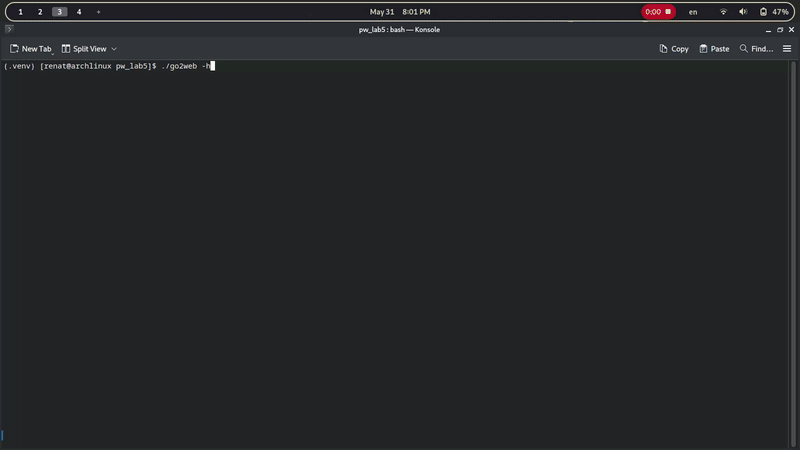

# Implementation Description

A lightweight Python command-line tool for making HTTP requests and web searches without external HTTP libraries, using raw socket implementation.

## Features

### Core Functionality
- `-u <URL>` - Make HTTP/HTTPS requests and display formatted responses
- `-s <search-term>` - Search the web and display top 10 results
- `-h` - Display help message and usage examples

### Advanced Features
✅ **Raw Socket Implementation** - Manual HTTP/1.1 protocol handling  
✅ **TLS/SSL Support** - Secure HTTPS connections via Python's ssl module  
✅ **Intelligent Formatting**:
  - HTML → Clean, readable text conversion
  - JSON → Pretty-printed with syntax highlighting  
✅ **Persistent Caching** - Local cache storage in `~/.go2web_cache/`  
✅ **Search Integration** - Bing results parsing with accurate CSS selection  
✅ **Redirect Handling** - Automatic following of HTTP 301/302 redirects  
✅ **Interactive Mode** - Select and open search results directly  

## Live Demo
